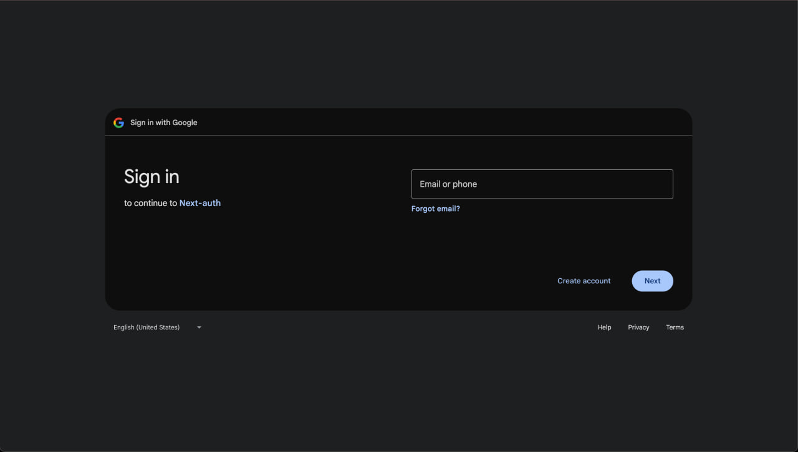

# JobStack - Modern Job Board Platform

A Next.js-powered job board featuring Google authentication, detailed listings, and responsive design.

## Key Features

- **Secure Authentication**: Email/password signup with OTP verification + Google OAuth
- **Form Validation**: Real-time feedback for invalid emails/passwords
- **OTP Verification**: Secure email confirmation for custom signups
- **Rich Job Listings**: Detailed view with responsibilities, requirements, and company info
- **Smart Filtering**: Sort by relevance, date posted, and job type


## Quick Start

1. **Clone the repo**
   ```bash
   git clone https://github.com/Aperca/job-listings-board.git
   cd jobstack
   ```

2. **Install dependencies**
   ```bash
   npm install
   ```

3. **Set up environment**
   ```bash
   cp .env.example .env.local
   # Fill in your Google OAuth credentials
   ```

4. **Run the development server**
   ```bash
   npm run dev
   ```

5. **Open** `http://localhost:3000` in your browser

## Authentication Flows

### Custom Signup

- User enters email/password
- System validates:
  - Proper email format (user@domain.com)
  - Password strength (min 8 chars)
- On success:
  - OTP sent to email
  - Redirect to verification page

### Google Signup

- Click "Continue with Google"
- Google handles verification
- Immediate access upon success

## Error Handling

- Invalid credentials show specific feedback
- Account lockout after multiple failed attempts

## Technologies

- **Frontend**: Next.js 14, React 18, TypeScript
- **Styling**: Tailwind CSS + Lucide icons
- **Authentication**: NextAuth.js
- **Validation**: React Hook Form + Zod

## Troubleshooting

### OTP Not Received?

- Check spam folder
- Wait 2 minutes before resending
- Verify email entered correctly

### Port Conflicts

```bash
npx kill-port 3000
npm run dev
```

## Screenshots

|  |  |
|-----------------------------------|----------------------------------------|
| *A Welcome page*     | *View job listings*           |

|  |  |
|--------------------------------------------------|---------------------------------------|
| *Signup page*                      | *Secure email verification flow*         |

|  |  |
|----------------------------------------|-------------------------------------------------|
| *One-click Google sign-in*             | *Error handling for failed logins*              |